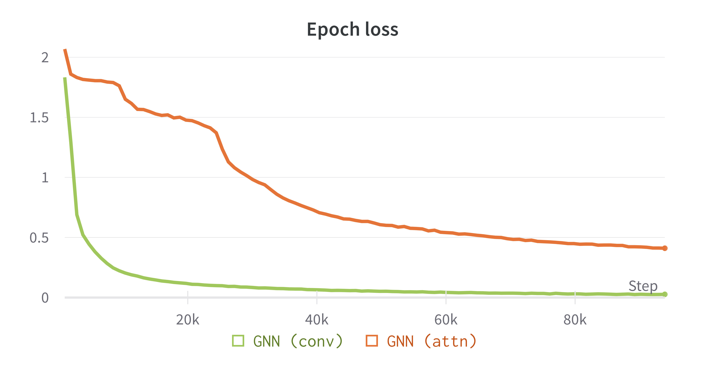
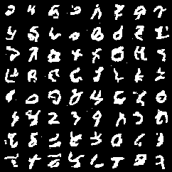
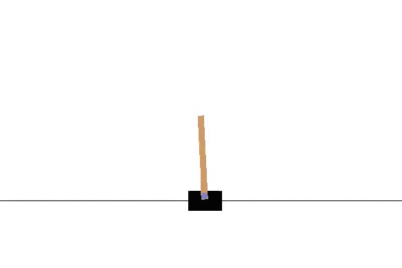
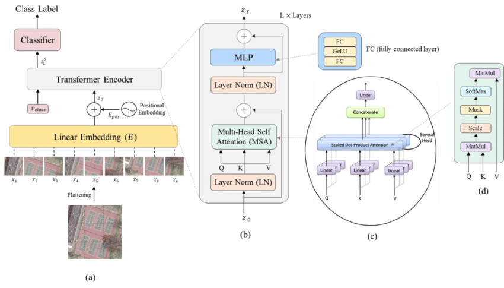

# Overview

Personal re-implementations of known Machine Learning architectures, layers, algorithms and more.
Re-implementations might be simplified and inefficient. The goal is learning / familiarizing / practicing with the core concepts without digging into too many details.

Current re-implementations include:
- [Overview](#overview)
- [Reimplementations](#reimplementations)
  - [DDPM - Denoise Diffusion Probabilistic Models](#ddpm---denoise-diffusion-probabilistic-models)
  - [FFF - Fast Feedforward Networks](#fff---fast-feedforward-networks)
  - [GNNS - Graph Neural Networks](#gnns---graph-neural-networks)
  - [GPT - Generative Pre-trained Transformer](#gpt---generative-pre-trained-transformer)
  - [Language Modelling is Compression](#language-modelling-is-compression)
  - [NF - Normalizing Flows](#nf---normalizing-flows)
  - [PPO - Proximal Policy Optimization](#ppo---proximal-policy-optimization)
  - [ViT - Vision Transformers](#vit---vision-transformers)
- [License](#license)


# Reimplementations
## DDPM - Denoise Diffusion Probabilistic Models


Implementation of the "_Denoising Diffusion Probabilistic Models_" [paper](https://arxiv.org/abs/2006.11239).
I use MNIST and FashionMNIST dataset as toy examples. The model used is a custom U-Net like architecture with the use of
positional embeddings.
Pre-trained models for both datasets (20 epochs only) are provided in the when
using [Git Large File System](https://git-lfs.github.com/).
Check out the [Blog](https://medium.com/mlearning-ai/enerating-images-with-ddpms-a-pytorch-implementation-cef5a2ba8cb1)
for a step-by-step explanation.

## FFF - Fast Feedforward Networks
Re-implementation of [*Fast Feedforward Networks*](https://arxiv.org/abs/2308.14711v2) by Peter Belcak and Roger Wattenhofer. A fast feedforward network has a binary tree structure, where the goal is having the network learning in which path to send its input to do computations, instead of computing the whole sparse product typical in regular feedforward networks. During training, the input is sent throughout the computational tree and a weighted sum of the leaves activations is used. During testing, only one path down the tree is taken. The network is trained with an entropy penalty during training.

In the main script, I use a single FFF network with depth 3 (8 leaves), input dimensionality 28 x 28 and hidden dimension of 32 for both leaves and nodes to learn a classifier for MNIST.

## GNNS - Graph Neural Networks


Implementation of **Convolutional** and **Attentional** Graph Neural Networks (**GNNs**) taking inspiration from Petar Veličković "_Everything is Connected: Graph Neural Networks_" [survey](https://arxiv.org/pdf/2301.08210v1.pdf). Graph neural networks implemented differ in the way messages are passed.

I use these GNNs for the task of image classification (Graph property prediction) converting the MNIST digits into connected graphs (each pixel is a node, and it is connected to its neighbouring pixels in space).

:warning: The implementation is inefficient for sparsely connected graph, as all possible connections are considered before being masked by the adjecency matrix (squared complexity in the number of nodes). The goal is to simply familiarize with GNNs.

From this implementation from scratch it is noticeable how the convolutional GNN converges faster than the more powerful attentional GNN for the toy dataset which favours the inductive bias provided by the convolution.

## GPT - Generative Pre-trained Transformer

Decoder-only implementation of a GPT model from "_Attention is all you need_" [paper](https://arxiv.org/abs/1706.03762).
I simply train the transformer on _1984_, the novel by George Orwell, based on next-character prediction. Samples generated by the model are stored into a file.

Samples obtained out of a small transformer (depth 6, width 384, 6 heads) can be found under [/gpt/generated.txt](/gpt/generated.txt). Here are a few:
```
################ SAMPLE 6 ################
Winston's heart brostless, then she got up with
a trays that dark was governed upon. They were little because of what they
could give him a day afraid of the Ninth Three-Year Plenty went out. The
doors had looked into his arms. On the evenings he murmuries

################ SAMPLE 16 ################
g.

'But this iden't boy,' he said, lave he said. 'The Party, didn't mean
it got into the barmty of Newspeak.'--and then he safer anything victim round
anything, as I'm reading to be anything but. They can't be take they can't
shoe, an year ago:

'Ah, five

################ SAMPLE 18 ################
Gothern's earlier stations and elusions
against planned the steps. The next purpose were interested. The same of
the tongue of the Revolution is were reality. The programmans that he had
stopped involving the Spies intercounted as phrase.
```

## Language Modelling is Compression
Implementation of "_Language Modelling Is Compression_" [paper](https://arxiv.org/abs/2309.10668) by Delétang and Ruoss et. al. I use a pre-trained language model to encode, using arithmetic encoding, full sentences into scalars in range `[0, 1]`. Every scalar can then be de-coded into the input ids that made up the sentence.

For example, using `EleutherAI/pythia-1.4b-v0`, the sentence "_`The quick brown fox jumps over the lazy dog`_" is encoded to the number `0.36453413`.

Currently, this greatly suffers from precision errors, and only the first few tokens can be recovered exactly.

## NF - Normalizing Flows



Implementation of the "_Density estimation using Real NVP_" [paper](https://arxiv.org/abs/1605.08803).
I re-implement and use 30 Affine Coupling layers to create a normalizing flow that can generate MNIST digits.
The generated digits come with associated log probabilities, which tell which images are the most likely according to
the model.

## PPO - Proximal Policy Optimization


Implementation of the famous _"Proximal Policy Optimization Algorithms"_ [paper](https://arxiv.org/abs/1707.06347).
I implement the simple PPO algorithm from scratch in pytorch using [weights & biases](https://wandb.ai) for logging the loss terms and the
average reward through iterations.

## ViT - Vision Transformers



Implementation of the "_An Image is Worth 16x16 Words: Transformers for Image Recognition at
Scale_" [paper](https://openreview.net/forum?id=YicbFdNTTy).
The MNIST dataset is used as a toy example for classification
task. [Blog](https://medium.com/mlearning-ai/vision-transformers-from-scratch-pytorch-a-step-by-step-guide-96c3313c2e0c)
.

# License
The code is released with the MIT license.
