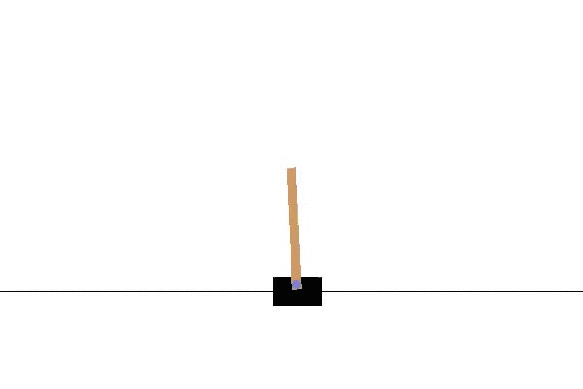

# Description

Personal re-implementations of known Machine Learning architectures, layers, algorithms and more.
Re-implementations might be simplified and approximate. The goal is learning / familiarizing / practicing with the core concepts 🙂.


# Packages
## ddpm


Implementation of the "_Denoising Diffusion Probabilistic Models_" [paper](https://arxiv.org/abs/2006.11239).
I use MNIST and FashionMNIST dataset as toy examples. The model used is a custom U-Net like architecture with the use of
positional embeddings.
Pre-trained models for both datasets (20 epochs only) are provided in the when
using [Git Large File System](https://git-lfs.github.com/).
Check out the [Blog](https://medium.com/mlearning-ai/enerating-images-with-ddpms-a-pytorch-implementation-cef5a2ba8cb1)
for a step-by-step explanation.

## gnns

Implementation of various Graph Neural Networks (GNNs) taking inspiration from Petar Veličković "__" [survey](https://arxiv.org/pdf/2301.08210v1.pdf). Graph neural networks implemented differ in the way messages are passed (from least to most expressive):

 - Convolutional GNN
 - Attentional GNN
 - Message-Passing GNN

I use these GNNs for the task of image classification (Graph property prediction) on the CIFAR-10 dataset.

## gpt

Decoder-only implementation of a GPT model from "_Attention is all you need_" [paper](https://arxiv.org/abs/1706.03762).
I simply train the transformer on _1984_, the novel by George Orwell, based on next-character prediction. Samples generated by the model are stored into a file.

Samples obtained out of a small transformer (depth 6, width 384, 6 heads) can be found under [/gpt/generated.txt](/gpt/generated.txt). Here are a few:
``` 
################ SAMPLE 6 ################
Winston's heart brostless, then she got up with
a trays that dark was governed upon. They were little because of what they
could give him a day afraid of the Ninth Three-Year Plenty went out. The
doors had looked into his arms. On the evenings he murmuries

################ SAMPLE 16 ################
g.

'But this iden't boy,' he said, lave he said. 'The Party, didn't mean
it got into the barmty of Newspeak.'--and then he safer anything victim round
anything, as I'm reading to be anything but. They can't be take they can't
shoe, an year ago:

'Ah, five

################ SAMPLE 18 ################
Gothern's earlier stations and elusions
against planned the steps. The next purpose were interested. The same of
the tongue of the Revolution is were reality. The programmans that he had
stopped involving the Spies intercounted as phrase.
```

## nf

Implementation of the "_Density estimation using Real NVP_" [paper](https://arxiv.org/abs/1605.08803).
I re-implement and use 30 Affine Coupling layers to create a normalizing flow that can generate MNIST digits.
The generated digits come with associated log probabilities, which tell which images are the most likely according to
the model. Here's a glance at the (not so impeccable) final result:


## ppo
Implementation of the famous _"Proximal Policy Optimization Algorithms"_ [paper](https://arxiv.org/abs/1707.06347). 
I implement the simple PPO algorithm from scratch in pytorch using [weights & biases](https://wandb.ai) for logging the loss terms and the 
average reward through iterations.



## vit


Implementation of the "_An Image is Worth 16x16 Words: Transformers for Image Recognition at
Scale_" [paper](https://openreview.net/forum?id=YicbFdNTTy).
The MNIST dataset is used as a toy example for classification
task. [Blog](https://medium.com/mlearning-ai/vision-transformers-from-scratch-pytorch-a-step-by-step-guide-96c3313c2e0c)
. 
