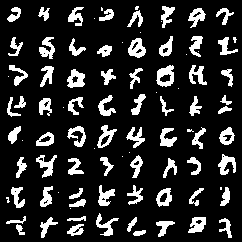

# Description

Personal re-implementations of known Machine Learning architectures, layers, algorithms and more.
Re-implementations might be simplified and approximate. The goal is learning the core concepts 🙂.

## Package ddpm

Implementation of the "_Denoising Diffusion Probabilistic Models_" [paper](https://arxiv.org/abs/2006.11239).
I use MNIST and FashionMNIST dataset as toy examples. The model used is a custom U-Net like architecture with the use of
positional embeddings.
Pre-trained models for both datasets (20 epochs only) are provided in the package when
using [Git Large File System](https://git-lfs.github.com/).
Check out the [Blog](https://medium.com/mlearning-ai/enerating-images-with-ddpms-a-pytorch-implementation-cef5a2ba8cb1)
for a step-by-step explanation.

## Package nf

Implementation of the "_Density estimation using Real NVP_" [paper](https://arxiv.org/abs/1605.08803).
I re-implement and use 12 Affine Coupling layers to create a normalizing flow that can generate MNIST digits.
The generated digits come with associated log probabilities, which tell which images are the most likely according to
the model.

## Package vit

Implementation of the "_An Image is Worth 16x16 Words: Transformers for Image Recognition at
Scale_" [paper](https://openreview.net/forum?id=YicbFdNTTy).
The MNIST dataset is used as a toy example for classification
task. [Blog](https://medium.com/mlearning-ai/vision-transformers-from-scratch-pytorch-a-step-by-step-guide-96c3313c2e0c)
. 
